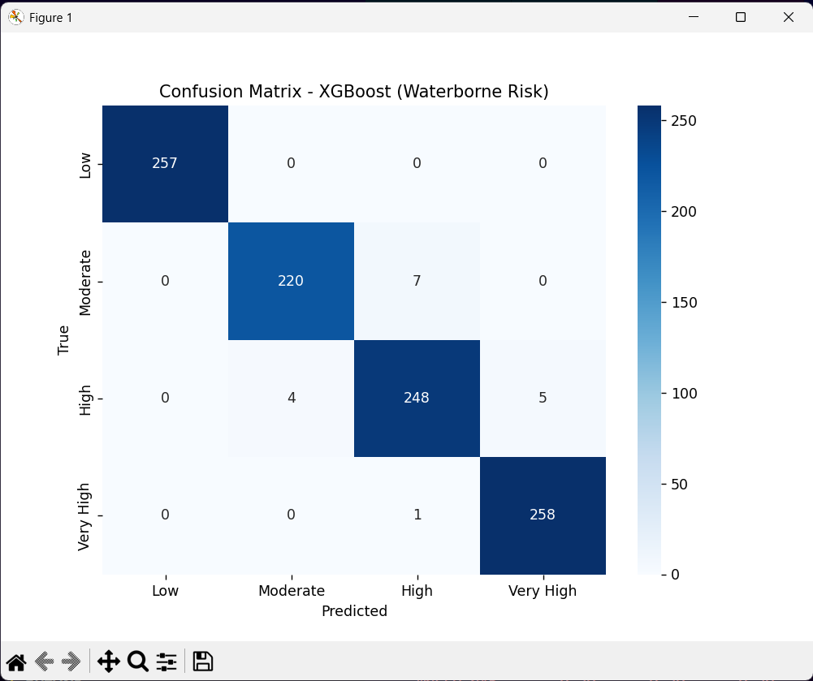

# Water-Borne Disease Risk Prediction (XGBoost)

This repository contains scripts to train and evaluate a **multi-class XGBoost model** that predicts water-borne disease risk categories:

- **Low**  
- **Moderate**  
- **High**  
- **Very High**  

The classification is based on water quality indicators and health-related data.

---

## 📂 Project Structure

├── Data/
│ ├── water_risk_data_4000.csv # Training dataset

│ └── water_risk_data_1000.csv # Testing dataset

├── Train.py # Train & save the model

├── Test.py # Load model & evaluate

├── requirements.txt # Dependencies

└── README.md # Documentation


---

## 🚀 How to Run

### 1. Clone the repository
```bash
git clone https://github.com/JayThakare05/ML-Models.git
cd Models/Water_borne_disease_Village_riskPrediction
```

##2. Create a virtual environment (recommended)

python -m venv venv
source venv/bin/activate   # Linux/Mac
venv\Scripts\activate      # Windows

Install dependencies

pip install -r requirements.txt


train the model

python Train.py

This will generate:

xgboost_WBD.pkl → trained model

risk_labels.pkl → category mapping

5. Test & evaluate the model
python Test.py


This will:

Load the saved model

Run predictions on water_risk_data_1000.csv

Save results to water_risk_predictions.csv

Print accuracy & classification report

Display a confusion matrix heatmap

📑 Dataset Format

Both training (water_risk_data_4000.csv) and testing (water_risk_data_1000.csv) files should include:

Features

turbidity

pH

TDS

color_smell

cases_per_1000

abd_pain_per_1000

fever_per_1000

dehydr_per_1000

Target

risk_category (values: Low, Moderate, High, Very High)

📊 Model Details

Algorithm: XGBoostClassifier

Parameters:

n_estimators = 200

learning_rate = 0.1

max_depth = 6

eval_metric = "mlogloss"

Split: 80/20 stratified train-test split

📷 Example Outputs

(Replace images/... with your actual saved plots if available)


📦 Outputs

xgboost_WBD.pkl → trained model

risk_labels.pkl → category mapping

water_risk_predictions.csv → predictions + probabilities

🔮 Future Improvements

Add cross-validation during training

Tune hyperparameters (GridSearch/Optuna)

Integrate with Streamlit/Django for live predictions

Build monitoring system for real-time water quality data

✅ Model Accuracy

Final Test Accuracy: 0.9825

👨‍💻 Author

Jay Thakare


