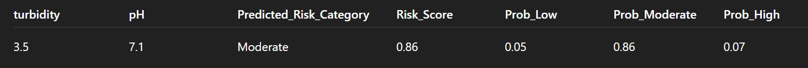

# Water-Borne Disease Risk Prediction (XGBoost)

This repository contains scripts to train and evaluate a **multi-class XGBoost model** that predicts water-borne disease risk categories:

- Low  
- Moderate  
- High  
- Very High  

The classification is based on water quality indicators and health-related data.

---

## 📂 Project Structure
├── Data/
│ ├── water_risk_data_4000.csv # Training dataset
│ └── water_risk_data_1000.csv # Testing dataset
├── Train.py # Train & save the model
├── Test.py # Load model & evaluate
├── requirements.txt # Dependencies
└── README.md # Documentation


---

## 🚀 How to Run

### 1. Clone the repository
```bash
    git clone https://github.com/your-username/water-borne-disease-risk.git
    cd water-water-borne-disease-risk

Create a virtual environment (recommended)
    python -m venv venv
    source venv/bin/activate   # Linux/Mac
    venv\Scripts\activate      # Windows

Install dependencies
    pip install -r requirements.txt 

Train the model
    python Train.py

This will generate:
xgboost_WBD.pkl → trained model
risk_labels.pkl → category mapping

Test & evaluate the model
python Test.py

This will:
    Load the saved model
    Run predictions on water_risk_data_1000.csv
    Save results to water_risk_predictions.csv
    Print accuracy, classification report
    Display a confusion matrix heatmap

Dataset Format
Training file: water_risk_data_4000.csv
Testing file: water_risk_data_1000.csv
Both should include:
Features
    turbidity
    pH
    TDS
    color_smell
    cases_per_1000
    abd_pain_per_1000
    fever_per_1000
    dehydr_per_1000

Target
    risk_category (values: Low, Moderate, High, Very High)
📊 Model Details
    Algorithm: XGBoostClassifier
    Parameters:
    n_estimators=200
    learning_rate=0.1
    max_depth=6
    eval_metric="mlogloss"
    Split: 80/20 stratified train-test split



Outputs
    xgboost_WBD.pkl → trained model
    risk_labels.pkl → category mapping
    water_risk_predictions.csv → predictions + probabilities

🔮 Future Improvements
    Add cross-validation during training
    Tune hyperparameters (GridSearch/Optuna)
    Integrate with Streamlit/Django for live predictions
    Build monitoring system for real-time water quality data

Accuracy:- 0.9825

👨‍💻 Author
Jay Thakare
